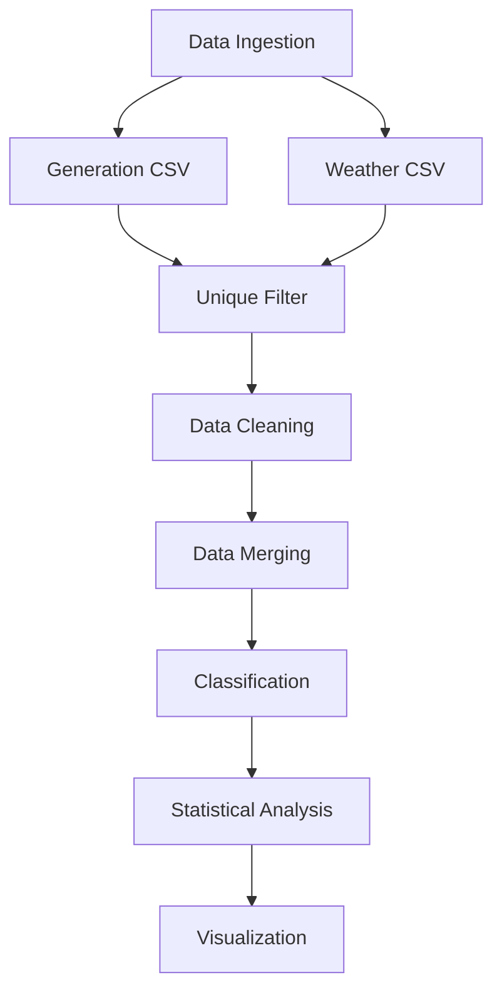

# Filter Logic — Visual Walkthrough

> ⚠️ **Note:** This branch is not a standalone implementation. It is a step-by-step visual walkthrough of how the unique filter logic works inside the main pipeline. All actual working code lives in `main.py` of the `main` branch.

---

## Overview

This notebook (FilterLogic.ipynb) explains the data filtering and preprocessing stages of the pipeline in clear and organized steps. It demonstrates how the raw Kaggle dataset — containing 68,778 generation records and 3,182 weather records — is filtered and refined into the 621 clean telemetry records used for the final analysis.

Each cell corresponds to a specific stage in the pipeline flowchart below.

---

## Pipeline Flowchart



---

## Filter Parameters

```python
PLANT_ID              = 4135001
START_DATE            = "2020-05-15"
END_DATE              = "2020-05-31"
START_HOUR            = 8       # 08:00
END_HOUR              = 17      # 17:00
IRRADIATION_THRESHOLD = 0.3     # kW/m² — cloud cover threshold
```

---

## Step-by-Step Breakdown

### Step 1 — Data Ingestion
Load both raw CSV files and check their initial row counts before any filtering.

```
Generation rows : 68,778
Weather rows    : 3,182
```

### Step 2 — Unique Filter
Three filters are applied in sequence to isolate the specific data slice used in this study:

**Filter 1 — Plant ID**
Keep only records belonging to `PLANT_ID = 4135001`.

**Filter 2 — Date Range**
Parse `DATE_TIME` into a proper `DATETIME` column, then keep only records between `May 15` and `May 31, 2020`.

**Filter 3 — Daytime Hours**
Extract the hour from `DATETIME` and keep only records where `HOUR` is between `08:00` and `17:00`.

```
After filtering → Generation: 13,638 rows | Weather: 621 rows
```

### Step 3 — Data Cleaning
Check for duplicates and missing values before and after cleaning.

```
Before Cleaning
  Generation — rows: 13,638 | missing values: 0
  Weather    — rows: 621    | missing values: 0

After Cleaning
  Generation — rows: 13,638 | duplicates removed: 0 | missing values: 0
  Weather    — rows: 621    | duplicates removed: 0  | missing values: 0
```

Missing numeric values (if any) are filled using **median imputation**.

### Step 4 — Data Merging
Generation data is first aggregated by `DATETIME` and `PLANT_ID` (summing DC and AC power, averaging yields), then merged with the weather dataset using an **inner join**.

```
Final merged dataset → 621 records
Columns: DATETIME, AC_POWER, DC_POWER, IRRADIATION, MODULE_TEMPERATURE, ...
```

### Step 5 — Classification
Each record is labeled as `Clear-Sky` or `Cloud-Affected` based on the irradiation threshold. An efficiency ratio (`AC_POWER / DC_POWER`) is also computed per timestamp.

```
Irradiation threshold : 0.3 kW/m²
Cloud-Affected        : 126 rows
Clear-Sky             : 495 rows
```

---

## Files in This Branch

```
EDS_4764_Laude/
│
├── FilterLogic.ipynb   # Step-by-step notebook walkthrough
├── Flowchart.png       # Pipeline flowchart diagram
├── requirements.txt    # Required Python libraries        
└── README.md           # This file
```

---

## 👤 Author

**Ruselle Rae D. Laude** | `TUPM-25-4764`
<br/>
Electronics Engineering Department
<br/>
Technological University of the Philippines, Manila
<br/>
rusellerae.laude@tup.edu.ph